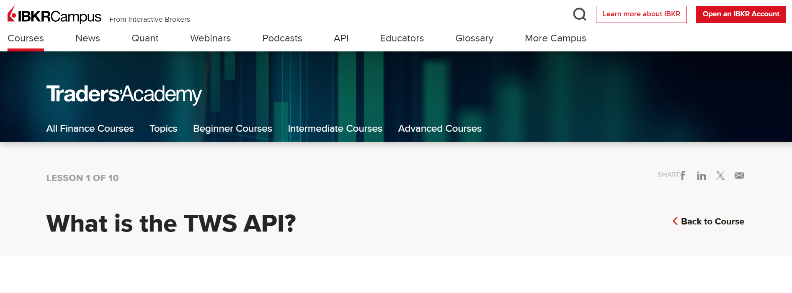

# Curso de IBKR: Python TWS API
|[Atrás](./lecciones/leccion10.md "Atrás")|[Siguiente](./lecciones/leccion2.md "Siguiente")|
|---|---:|

## Lección 1: ¿Qué es la API de TWS?

A quien está dirigido:  

El público objetivo de este curso son programadores externos a IBKR con experiencia en uno de estos en lenguajes de programación de propósito general como: Python, Java, C# y C++ que estén interesados ​​en crear aplicaciones personalizadas.

| Requisitos de hardware y software: | 
|---|
| Sistema operativo Windows, Linux o Mac OS con una interfaz gráfica de usuario. | 
| Python 3.3 o superior instalado. | 
| Familiaridad con la programación en Python. | 
| La API de TWS utiliza programación de sockets. |

| FAQ | Respuesta: |
|---|---|
| Qué es la API de TWS | Es un medio común de conexión disponible para todos los clientes que tienen cuenta de usuario de IBKR, y una forma mediante la cual las aplicaciones comerciales personalizadas o de terceros pueden realizar sus pedidos. |
| Qué puede proporcionar la API de TWS | La API de TWS brinda la capacidad de automatizar algunas acciones dentro de TWS desde software externo.|
| Dónde se puede encontrar la API de TWS  | El código fuente de la API de TWS se proporciona bajo un acuerdo de licencia no comercial de https://interactivebrokers.github.io/ y un programador puede utilizarlo para escribir una aplicación personalizada que se conecte a TWS. |

### Mayor información:
| Fuente: | Enlace: |
|---|---|
|Curso | https://ibkrcampus.com/trading-lessons/what-is-the-tws-api/ |
Guía de referencia de API y Guía del usuario de IB Gateway | https://ibkrcampus.com/ibkr-api-page/twsapi-doc/ |
| Portal del IB  | https://gdcdyn.interactivebrokers.com/en/index.php?f=16454 |
| Investors MarketPlace para desarrolladores externos  | https://gdcdyn.interactivebrokers.com/Marketplace/InvestorsMarketplace |

|[Atrás](./lecciones/leccion10.md "Atrás")|[Siguiente](./lecciones/leccion2.md "Siguiente")|
|---|---:|
