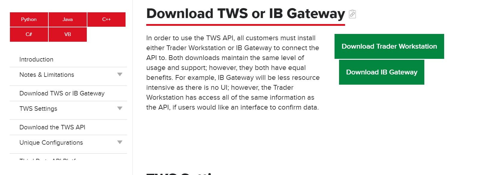
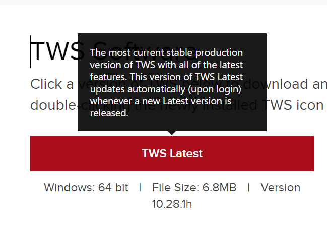
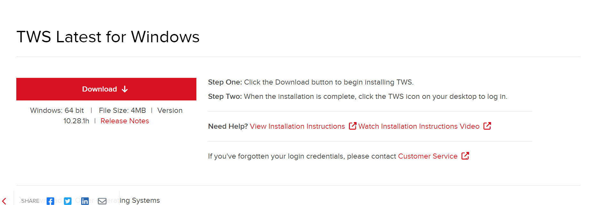
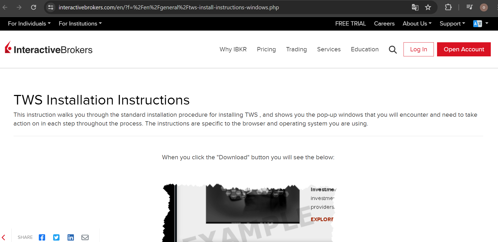
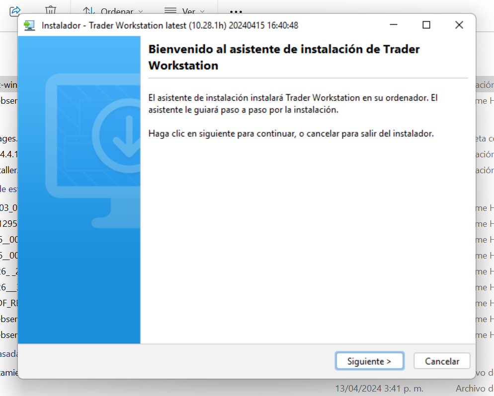
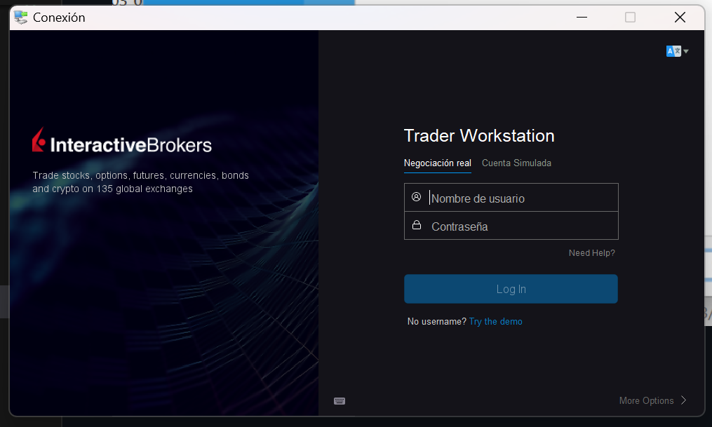

# Curso de IBKR: Python TWS API
|[Atrás](./leccion2.md "Atrás")|[Siguiente](./leccion2.2.md "Siguiente")|
|---|---:|

## Lección 2: Instalación y configuración de TWS para la API

### 2.1 Portal del IB

La alternativa al uso de TWS para usuarios de API es utilizar un programa llamado IB Gateway. La descarga de IB Gateway se puede encontrar en el sitio web en el menú Trading > API .

Desde una perspectiva API, IB Gateway es casi idéntico a TWS.

Una aplicación que se conecta y utiliza la API con TWS también puede utilizar IB Gateway.

La principal diferencia de IB Gateway es que está completamente orientado a la funcionalidad API y no proporciona acceso a la información de la cuenta a través de una GUI de la misma manera que lo hace TWS. Por ello, es una aplicación más pequeña y que requiere menos recursos.

Las versiones equivalentes de TWS e IB Gateway siempre se publican juntas. Por ejemplo, si la última versión actual de TWS es 10.18.1c, entonces la última versión actual de IB Gateway también es 10.18.1c.

https://ibkrcampus.com/ibkr-api-page/twsapi-doc/#tws-download

Darle click al Download Trader Workstation, aparece como sigue:

https://www.interactivebrokers.com/en/trading/tws.php#tws-software

Descargar la última versión:  

Te redirecciona a esta ruta:

https://www.interactivebrokers.com/en/trading/tws-updateable-latest.php

Paso uno: haga clic en el botón Descargar para comenzar a instalar TWS.

Paso dos: cuando se complete la instalación, haga clic en el ícono TWS en su escritorio para iniciar sesión.

## Instrucciones de instalación:

https://www.interactivebrokers.com/en/?f=%2Fen%2Fgeneral%2Ftws-install-instructions-windows.php

Esta instrucción lo guía a través del procedimiento de instalación estándar para instalar TWS y le muestra las ventanas emergentes que encontrará y en las que deberá tomar medidas en cada paso del proceso. Las instrucciones son específicas del navegador y del sistema operativo que esté utilizando.

siguiente, siguiente...

Ya está instalado, pasa a la siguiente página.

|[Atrás](./leccion2.md "Atrás")|[Siguiente](./leccion2.2.md "Siguiente")|
|---|---:|
