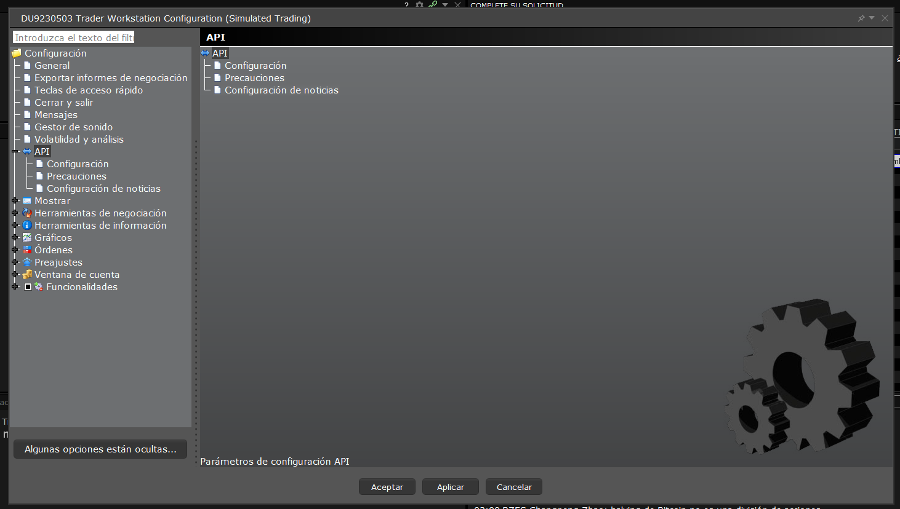
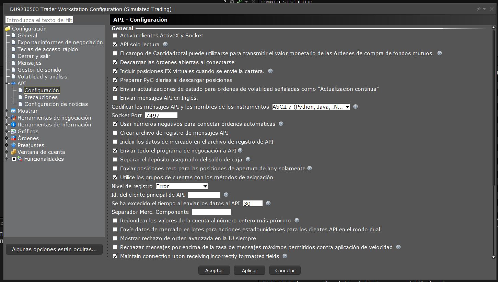
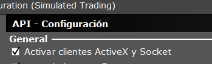
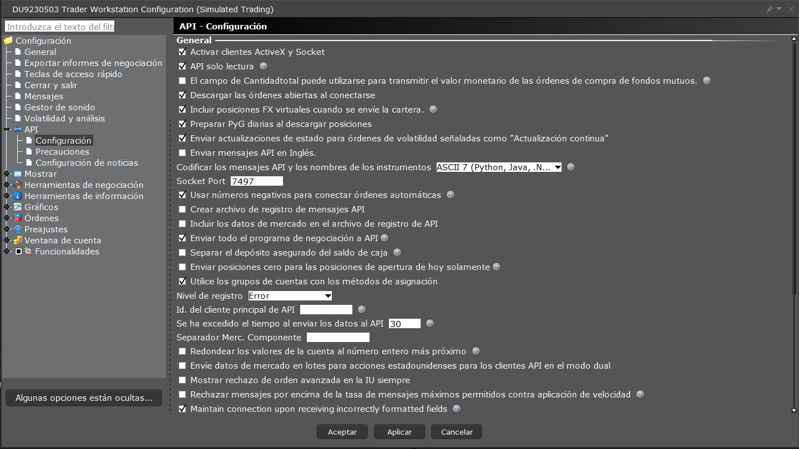
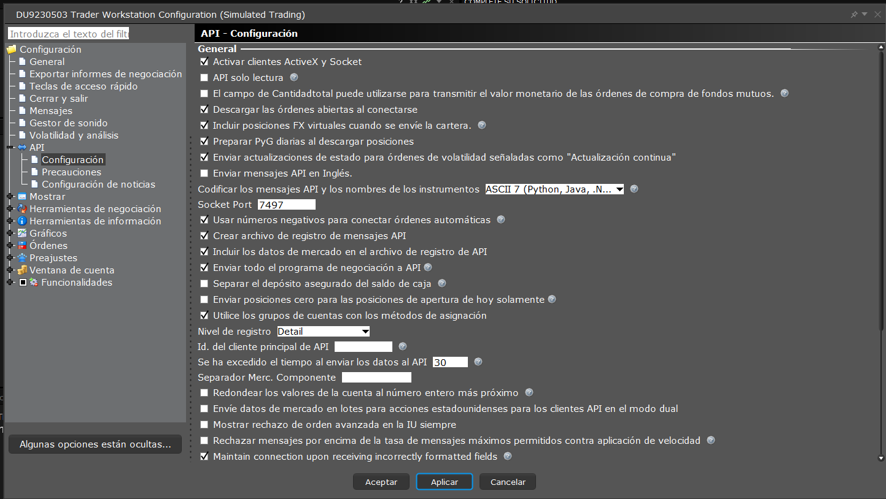
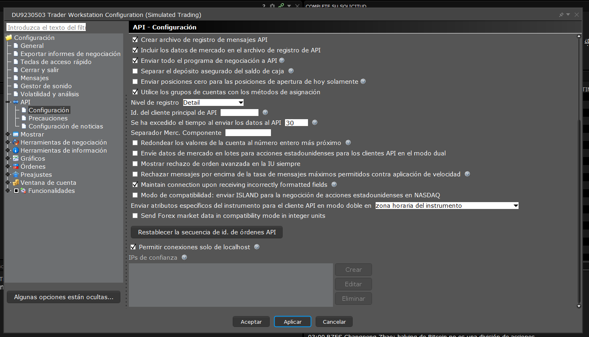

# Curso de IBKR: Python TWS API
|[Atrás](./leccion2.2.md "Atrás")|[Siguiente](./leccion3.md "Siguiente")|
|---|---:|

## Lección 2: Instalación y configuración de TWS para la API

### 2.3 Habilitar clientes ActiveX y Socket

API/

La configuración necesaria para habilitar las conexiones del cliente de socket para Python es la primera casilla de verificación denominada "Habilitar clientes ActiveX y Socket".

Las otras configuraciones que afectan la conexión inicial son:  

“Puerto de socket”: de forma predeterminada, TWS utiliza el puerto de socket 7496 para sesiones en vivo y 7497 para sesiones en papel. Por el contrario, IB Gateway utiliza 4001 para sesiones en vivo y 4002 para sesiones en papel. Sin embargo, estos son solo valores predeterminados y se pueden modificar según se desee: el puerto de socket en TWS debe configurarse para que coincida con el puerto de socket utilizado en la función connect() de los clientes API.

“Permitir conexiones solo desde Localhost”: marcar esta casilla configura TWS para (1) aceptar solo conexiones entrantes de aplicaciones API en la misma computadora y (2) evitar la necesidad de aceptar manualmente conexiones API entrantes. Mueve la barra de desplazamiento vertial hacia abajo.

Para habilitar el registro de mensajes API para solucionar problemas específicos de API, existen tres configuraciones notables:

“Crear registro de mensajes API”: se utiliza para crear un archivo de registro API que registrará todos los mensajes API.
"Incluir datos de mercado en el archivo de registro de API" incluirá todos los datos de mercado devueltos por esta solicitud en el registro.

"Nivel de registro" es un menú desplegable para ajustar la información presente en los registros. Si esto se establece en el nivel más alto llamado "Detalle", los registros de API documentarán todo el tráfico de API hacia y desde Trader Workstation.

Para obtener más información, visite el enlace de la guía de referencia a continuación.

Algunas configuraciones en la Configuración global que afectarán si se aceptan pedidos de la API:
La configuración 'Solo lectura' está habilitada de forma predeterminada y bloqueará todos los pedidos de API. Debe estar desmarcado para permitir cualquier pedido desde la API.
La configuración 'Precauciones' en API en el menú Configuración global hará que ciertas órdenes no se transmitan de forma predeterminada si exceden ciertas configuraciones de precaución hasta que se confirmen manualmente en TWS.
Algunos atributos de pedido que no se pueden configurar desde la API se configuran desde TWS. Por ejemplo, hay una configuración en la Configuración global de TWS llamada "Orden activa en sesión previa a la apertura" que no está disponible para ser configurada por la API, pero está en TWS y también afectará las órdenes de API.

En la próxima lección examinaremos el código fuente de la API en sí y discutiremos las clases principales de la API.

Contenido a traducir: [link...](https://ibkrcampus.com/trading-lessons/installing-configuring-tws-for-the-api/ "link...")

|[Atrás](./leccion2.2.md "Atrás")|[Siguiente](./leccion3.md "Siguiente")|
|---|---:|
